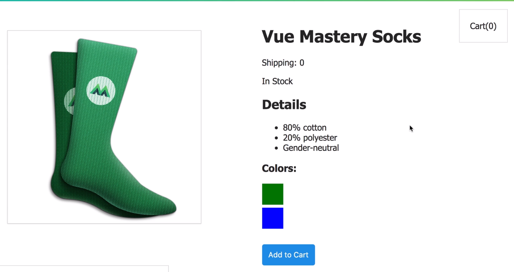

# VUE教程学习心得

视频课：<https://www.vuemastery.com/courses/intro-to-vue-js/vue-instance>

在视频课下面也有文字教程，可以谷歌直接翻译网页


下面是我的学习小笔记。


主要是以一个样例展开，有点像淘宝的一个商品界面，能够展示图片、信息，以及加入购物车，提交评论

移到颜色的时候会改变图片，是否是会员的运费也会不一致，根据库存量显示是否有货





首先下载了vue

```vue
var app = New Vue(){
	el:'#app',
data:{

}
}
```

建立一个新项目


建立一个vue实例 var app = New Vue({	

	el
	
	data

})

el相当于是id，会跟HTML文件中 id一致的模块相互绑定。

也可以把其中的data传递给HTML文件，只要{{variantName}}即可


attribute-bind

v-bind:src = "img"就是属性的绑定，有点像 v-bind:src={{img}}


conditional rendering

条件显示，用于制作是否有库存，当前什么颜色，是否为会员

v-if

v-if-else

v-else


list rendering

想要展示一整个列表的信息，一个个排列是非常麻烦的事情，自然而然地想到了使用循环

v-for ... ...


v-on事件的响应，当点击的时候要做出什么反应呢？这时候可以用v-on:click 同理还有v-on:mouseover ...

做出的反应就放在函数里，

除了data这个属性外，还有methods

在method中创建相应的反应。

v-on非常常用可以简写为@

v-on:click="updateStock()"


class 和 style的绑定

:style="{...,...,...}"

props能够让 父组件传信息给内部组件


可计算元素，computed:{	

	title(){	
	
		return this.brand + this.name
	
	}

}


组件的复用

vue的一大特性

//product是指代名字

Vue.component('product',{

	template:`
	
	...
	
	`,
	
	data(){//data变成了函数
	
	}

})

在使用的时候就能够在HTML文件

<product> </product>使用了，相当于自己定义了标签。


communicating events

当我们将product抽取为component之后，当我们点击了add to cart无法成功关联两个组件。

所以要使用事件传递出去，告诉被点击了。所以event的本质就是传递消息的渠道


form

